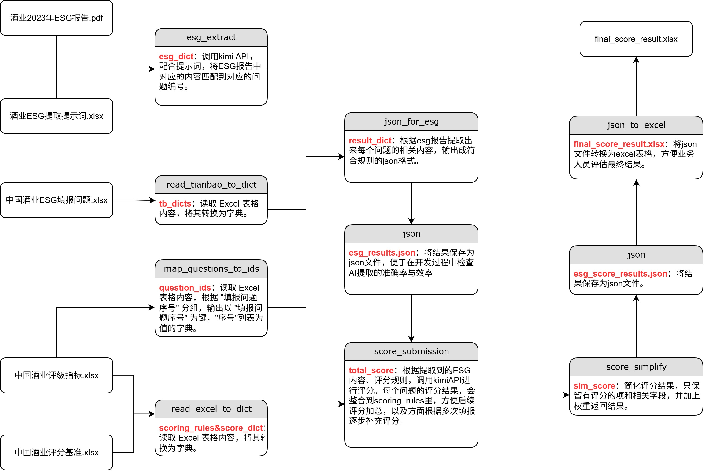

### **Software Engineer Intern**  
**January 2025 – June 2025 | ByteDance**  

Worked on the development and optimization of large-scale recommendation systems, focusing on algorithm improvements and system efficiency enhancements. Contributed to real-time data processing pipelines and model optimization for personalized content delivery.

#### Key Contributions:  
- Developed and optimized recommendation algorithms to enhance user engagement and content relevance.  
- Designed and implemented real-time data processing workflows to improve model inference efficiency.  
- Conducted A/B testing and performance analysis to refine recommendation strategies based on user behavior data.  

---

### **Agent开发实习生**  
**2024年11月 – 2025年2月 | 北京中创碳投科技有限公司**  

负责为中国酒业协会构建 “ESG 报告上传 → LLM 指标抽取 → 规则化打分 → API 回传” 全自动流水线，将单份报告处理周期从 2-3 天压缩至 < 1 分钟，支撑 2025 行业 ESG 白皮书的首轮量化评分。

#### 主要贡献:  
- LLM 指标抽取：设计 Few-shot Prompt + JSON Schema 校验流程，调用 Moonshot GPT 抽取并解析 102 项 E/S/G 指标，清洗为结构化 JSON。
- 规则化打分引擎：将抽取结果与业务部门的评分表整合为统一格式，调用GPT模型进行评分，并规范化评分结果。
- Excel ↔ JSON 双向映射工具：使用 Pandas + openpyxl 编写 Mapping DSL，支持评分规则版本化 & JSON→Excel 回写，保障数据轮转一致。
- FastAPI 微服务接口设计：将业务进行封装，支持后端调用。
- 跨部门数据格式协同：与 ESG 研究员共同定义 数据字典（字段命名、枚举值、缺失值策略），并建立版本控制。

#### 流程图简介：



---

### **NLP 系统开发工程师**  
**2025年3月 – 2025年6月 | 课程设计项目**  

负责构建面向航班查询场景的端到端 NLP 系统，涵盖“意图与槽位识别 → 模板分类 → 回复生成”完整流程。项目采用 PyTorch、HuggingFace Transformers、SentenceTransformers、LangChain 与 FAISS，覆盖从线性基线到 RAG-LLM 的 7 种模型，完成训练、评测、推理及部署。

#### 主要贡献:  
- 设计并实现基于 Transformer 的联合学习模型（槽位序列标注 + 模板分类），打通数据预处理→训练→推理→严格准确率评测的一体化链路；同时搭建数据加工流水线（变量展开、生成“问题→SQL 模板 + BIO 标签”、统一切分与映射），稳定产出最优权重与误差清单，提升 NL→SQL 的稳定性与可复现性。

- 构建以 T5 为核心的 NL→SQL 生成流水线（混合精度、早停与学习率调度），并将原始问句与已填值标准 SQL自动配对为可直接训练的样本，在测试集完成 strict-match 评测并沉淀最优 checkpoint + 可视化样例，支持快速定位错误与复现实验。

- 集成 SentenceTransformers + FAISS 与 LangChain 的检索增强生成（RAG），在零样本场景显著降低无关/错误生成比例并提升回答可控性（基于项目内部评测，约 15–20%）。

> [!NOTE]
> 下面各用**一个小例子**把两条模型线（T5 生成式；“槽位标注 + 模板分类”联合模型）讲清楚：做什么、怎么做、最后怎样评测。
> 
> ---
> 
> #### 例子1：T5 生成式 NL→SQL
> 
> **用户问句（已替换好变量）：**
> “查询 **2025-09-03** 上午 从 **北京** 到 **上海** 的航班编号。”
> 
> **怎么做（generation\_transformer\_model/predict）：**
> 
> 1. `cus_dataset.Seq2SQLDataset` 生成训练样本：
> 
>    * 输入文本：上面整句；
>    * 目标文本（Gold SQL）：
> 
>    ```sql
>    SELECT flight_id FROM flights
>    WHERE from_city='Beijing' AND to_city='Shanghai'
>      AND flight_date='2025-09-03' AND dep_period='morning';
>    ```
> 
>    * T5 分词后：输入→`input_ids`，目标→`labels`（PAD 用 -100 屏蔽）。
> 2. 训练时 T5 用 teacher forcing 预测下一 token，按交叉熵最小化。
> 3. 推理时 `model.generate(...)` 直接“从问句生成 SQL”。
> 
> **输出与评测（strict-match）：**
> 
> * 预测 SQL（Pred）：
> 
>   ```sql
>   select flight_id from flights where from_city='Beijing' and to_city='Shanghai' 
>     and flight_date='2025-09-03' and dep_period='morning';
>   ```
> * 与 Gold **逐字符比**：完全一致→计正确；大小写/空格/分号不同也会判错（这就是 strict-match 的苛刻点）。
> 
> ---
> 
> #### 例子2：联合模型（槽位序列标注 + 模板分类）
> 
> **用户问句（含槽位）：**
> “帮我查 **明天** 上午 从 **北京** 到 **上海** 的**航班数量**。”
> 
> **怎么做（classificaion\_transformer\_model/predict）：**
> 
> 1. **模板分类**：模型读整句语义，挑选最匹配模板，例如：
> 
>    ```
>    TPL_COUNT: 
>    SELECT COUNT(*) FROM flights 
>    WHERE from_city=:from_city AND to_city=:to_city 
>      AND flight_date=:date AND dep_period=:part_of_day;
>    ```
> 2. **槽位标注（BIO）**：对每个 token 贴标签并抽取值：
> 
>    ```
>    句子:   明天  上午  从  北京  到  上海  的  航班  数量
>    标签:   B-date B-part O   B-from I-from O  O   O     O
>    抽槽:   date=明天, part_of_day=上午, from_city=北京, to_city=上海
>    ```
> 3. **填槽生成 SQL**：把上面的值替到模板占位符：
> 
>    ```sql
>    SELECT COUNT(*) FROM flights
>    WHERE from_city='Beijing' AND to_city='Shanghai'
>      AND flight_date='2025-09-03' AND dep_period='morning';
>    ```
> 
>    （实际系统里，“明天/上午”会在预处理里归一化成日期与时段。）
> 
> **输出与评测（严格准确率）：**
> 
> * 只有当“模板判对”**且**“所有有效 token 的槽位标签全对”时，这条样本才计为**严格正确**；任一环节错则判错，有助于定位是**选错模板**还是**抽槽出错**。

---

### **AWS Serverless 图像上传与自动描述系统**  
**2025年3月 – 2025年6月 | 课程设计项目**  

在 AWS 上实现「图片上传 → 自动生成缩略图 → 生成图片描述 → 前端展示」的端到端 Serverless 流水线，做到上传即产出可展示内容。整体采用最小权限与分层安全设计，支持弹性伸缩与可观测性（ALB/ASG、S3、Lambda、RDS、Secrets Manager、CloudWatch）。

#### 主要贡献:  
- Serverless 事件链落地：设计 S3→EventBridge→Lambda 的“上传即处理”链路，uploads/ 下新对象分别触发 Annotation 与 Thumbnail 两支函数，自动生成 caption 与 128×128 缩略图并回写存储/数据库。

- AI 能力与密钥治理：AnnotationFunction 读取原图并调用 Google Gemini 生成描述，(image key, caption) 落库到 RDS；Gemini/RDS 凭据统一放入 Secrets Manager，运行期注入，避免明文与硬编码。

- 弹性与高可用工程化：配置 ASG 期望实例、伸缩，并以 ~60% CPU 为阈值触发扩缩容；ALB 跨可用区分发流量，VPC 公/私子网 + NAT/Bastion 保障出网与运维安全。

- 性能与弹性验证：使用 ApacheBench 对 /upload 做 20 并发×500 请求压测，100% 成功、平均 41 ms、吞吐 484 req/s；CloudWatch 指标出现 CPU 峰值与回落，验证 ALB 分流与 ASG 扩缩容的有效性。